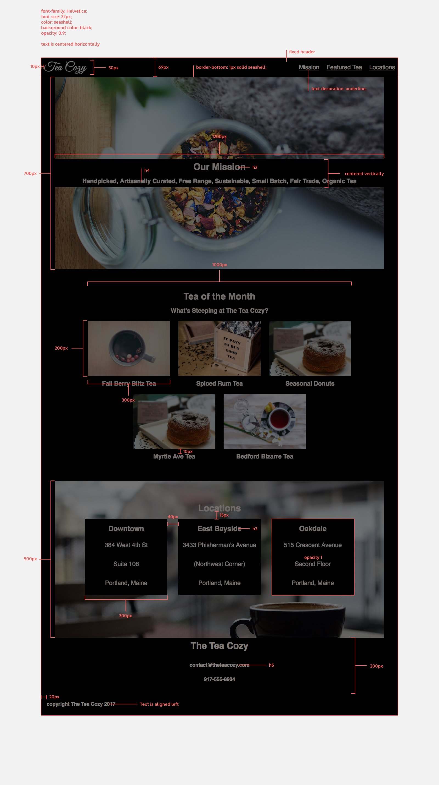

# tea-cozy
Off-platform project from Codecademy's "Full-Stack Engineer" path showcasing a responsive website layout built with CSS Flexbox, emphasizing alignment, spacing, and flexible design patterns.

## Description
Tea Cozy is a static website built as part of a Codecademy off-platform project.
The goal is to recreate the provided [design mock](resources/design/img-tea-cozy-redline.jpg) using semantic HTML and CSS Flexbox.

## Design Mock

## Requirements
- Match the layout and styling from the design mock
- Use semantic HTML
- Use Flexbox for layout
- Follow responsive design principles

## Technologies
- HTML5
- CSS3